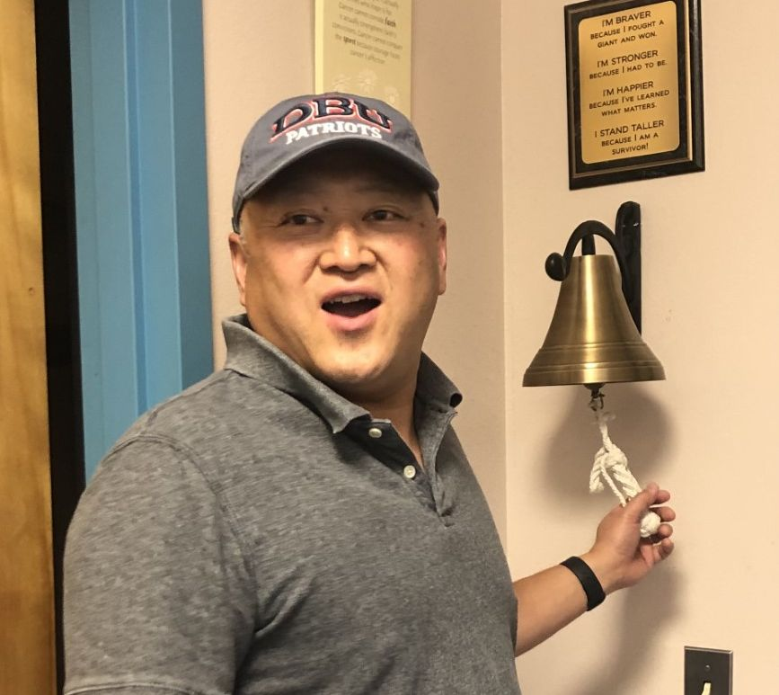

# A Personal Note from the Blog Curator
On July 14, 2020, I got out of the recliner feeling like I had the flu: I was groggy, slightly sick to my stomach and just wanted to go home and sleep. (Over three years later, just writing about it makes me feel slightly sick!) 
"You gotta ring the Bell!" the nurses told me. 
I really didn't want to - but they were so good to me, I had to. 
"Okay ...", I said, as I grasped the rope. 
"Wait - you have to read the poem, too!" they added. 
_Can't I just ring the bell? I just want to go home ... No - they've taken this journey with me. I'm reading it. _
I'm BRAVER because I fought a giant and won. 
I'm STRONGER because I had to be.
I'm HAPPIER because I've learned what matters.
I STAND TALLER because I am a survivor!
With every word, I said it with intensity. With every sentence, my heart stirred more. And every day since, I believe it more and more. 
Cancer hasn't defined me, but it has refined me. I'm one of the blessed ones. Not because I'm still alive (although I'm grateful to God for that!), but because a community of faith and the community of Roswell pulled together to help me get through cancer. 
If you're helping out with Walk for Hope by giving, helping, praying, walking, or otherwise supporting - on behalf of all of us - thanks for helping us STAND!

_Sean Lee, non-Hodgkin lymphoma (DLBC) survivor since 2020 _