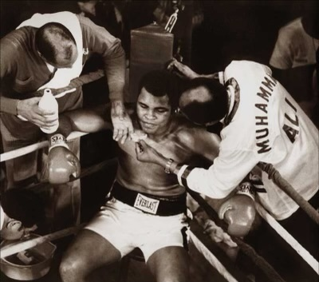

# You’ve got this

Walk for hope is in eight days. What is Walk for Hope? 

"The test results are in, and _you've got this_ ..." 

And there it is: "_The diagnosis_". 

At that point, life as you knew it, ends. Maybe it's not a death sentence, but every plan you assumed would happen has now been modified at best, put on hold, or cancelled. 

You look into the eyes of your spouse, your children, and your family and wonder: "How many more days? How many more opportunities?" 

What is Walk for Hope? It's the acknowledgement that, yes, _you have this_ ... but you are not defined by a disease and you are not declared _persona non grata_ by an infirmity; you still have the precious gift of life and have powerful influence of love and care for others. You have gifts yet to give. Yes. You may have this _thing_ ... but also, **we believe in you**. **We Believe:** _**You've got this**_**!**

It's the encouragement behind you, saying: "Take the step today. Let tomorrow worry about itself. You got this!" You've got fight in you. You've got a vicious intent to battle. With every opportunity and all the strength God gives you, you're going to fight. And you're bringing friends. Walk for Hope is Chaves County - with survivors like yourself, or their caregivers, or their families - saying: "We're behind you! We'll help you! _**You've got this**_!"

UPDATES as of October 6: 

1.  Team T-Shirt Pick-up: 
    
2.  9:00 - 11:00 
    
3.  Creative Learning Center - 200 W. Chisum
    

  

Team Packet - 17-25 Teams: first come, first serve as to location 

  

Luminarias : get decorated bags dropped by Saturday morning Oct. 14 th